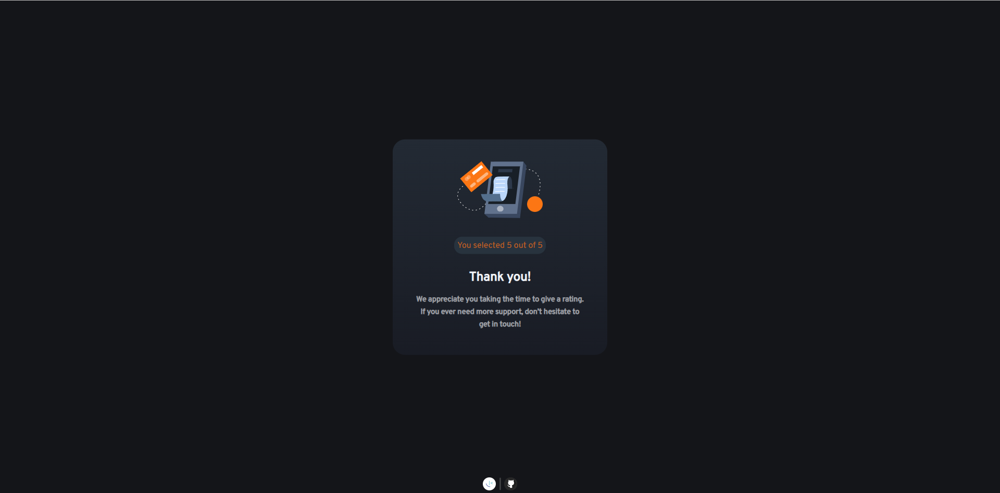

# Frontend Mentor - Interactive rating component solution

This is a solution to the [Interactive rating component challenge on Frontend Mentor](https://www.frontendmentor.io/challenges/interactive-rating-component-koxpeBUmI). Frontend Mentor challenges help you improve your coding skills by building realistic projects. 

## Table of contents

- [Overview](#overview)
  - [The challenge](#the-challenge)
  - [Screenshot](#screenshot)
  - [Links](#links)
- [My process](#my-process)
  - [Built with](#built-with)
  - [What I learned](#what-i-learned)
  - [Continued development](#continued-development)
- [Author](#author)

## Overview

### The challenge

Users should be able to:

- View the optimal layout for the app depending on their device's screen size
- See hover states for all interactive elements on the page
- Select and submit a number rating
- See the "Thank you" card state after submitting a rating

### Screenshot

### Links

- Solution URL: ["https://github.com/MoggStephen/interactive-rating-component-main"]
- Live Site URL: ["https://moggstephen.github.io/interactive-rating-component-main/"]

## My process

- Set up the html elements
- Set up sass using live compiler extension
- Set up the variables for certain colors and sizes that are found from the designs.
- Style the mobile version
- Style the desktop version

### Built with

- Semantic HTML5 markup
- Flexbox
- Mobile-first workflow
- sass partials,variables and nesting
- Correct class and id naming!

### What I learned

- Think i need to change the file and folder names to stop using camelcase and use hyphens like class names!

### Continued development

- Continue hyphen-delimited with class and id names.
- Change names of file and folders to all lowercase and hyphen delimited naming

## Author

- Frontend Mentor - [@MoggStephen](https://www.frontendmentor.io/profile/MoggStephen)